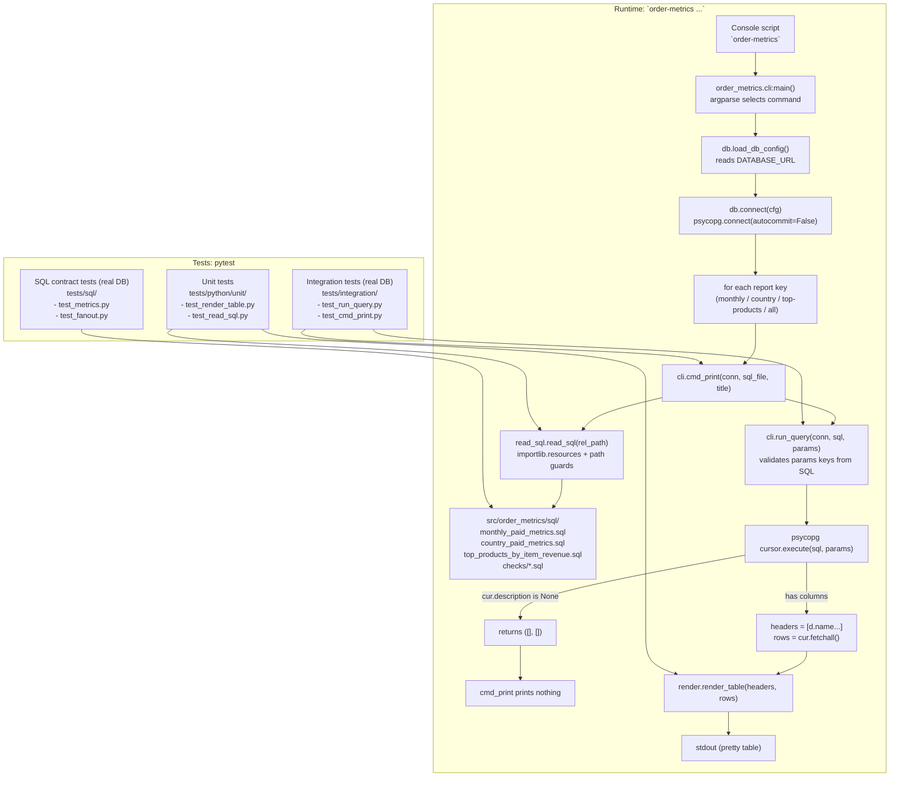

# Full Order-Metrics Architecture:

```mermaid
flowchart TD
  %% -------------------------
  %% Runtime / CLI execution
  %% -------------------------
  subgraph Runtime["Runtime: `order-metrics ...`"]
    EP["Console script<br/>`order-metrics`"] --> MAIN["order_metrics.cli:main()<br/>argparse selects command"]
    MAIN --> CFG["db.load_db_config()<br/>reads DATABASE_URL"]
    CFG --> CONN["db.connect(cfg)<br/>psycopg.connect(autocommit=False)"]
    CONN --> LOOP["for each report key<br/>(monthly / country / top-products / all)"]
    LOOP --> CMD["cli.cmd_print(conn, sql_file, title)"]

    CMD --> READ["read_sql.read_sql(rel_path)<br/>importlib.resources + path guards"]
    READ --> SQLASSET[("Packaged SQL files")]

    CMD --> RUN["cli.run_query(conn, sql, params)<br/>validates params keys from SQL"]
    RUN --> EXEC["psycopg cursor.execute(sql, params)"]

    EXEC -->|cur.description is None| EMPTY["returns ([], [])"]
    EMPTY --> NOP["cmd_print prints nothing"]

    EXEC -->|has columns| FETCH["headers = [d.name...]<br/>rows = cur.fetchall()"]
    FETCH --> RENDER["render.render_table(headers, rows)"]
    RENDER --> OUT["stdout (pretty table)"]
  end

  SQLASSET["src/order_metrics/sql/<br/>monthly_paid_metrics.sql<br/>country_paid_metrics.sql<br/>top_products_by_item_revenue.sql<br/>checks/*.sql"]

  %% -------------------------
  %% Tests / quality gates
  %% -------------------------
  subgraph Tests["Tests: pytest"]
    UNIT["Unit tests<br/>tests/python/unit/<br/>- test_render_table.py<br/>- test_read_sql.py"]
    INTEG["Integration tests (real DB)<br/>tests/integration/<br/>- test_run_query.py<br/>- test_cmd_print.py"]
    SQLT["SQL contract tests (real DB)<br/>tests/sql/<br/>- test_metrics.py<br/>- test_fanout.py"]
  end

  UNIT --> READ
  UNIT --> RENDER

  INTEG --> RUN
  INTEG --> CMD

  SQLT --> SQLASSET
```
