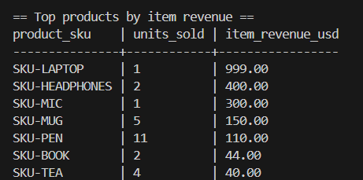
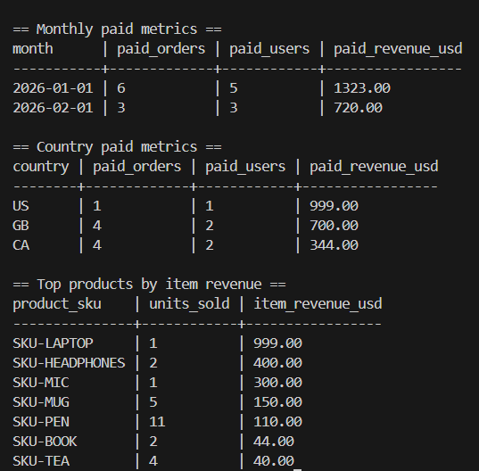

## Installation: Windows powershell
```bash
py -m venv .venv
.\.venv\Scripts\Activate.ps1
python -m pip install -U pip
python -m pip install -e ".[dev]"

# Set the DB connection and run
$env:DATABASE_URL="postgres://<user>:<pass>@localhost:5432/<db>"

# (optional) additionally test cli works and tests run
order-metrics all
pytest -q


## if order-metrics 'command isn't found':

# run via module `python -m` (always works)
python -m order_metrics.cli all

# Or re-open the shell after install and confirm 
# (sometimes PATH refresh issues on Windows):
python -m pip show order-metrics
```

# Order metrics
Display pretty tables from SQL queries on seeded data tables. 


# Usage:

Run `order-metrics` alongside whichever catagory you'd like to display in the termial.

## Example command:
  - `order-metrics top-products`:

And the resulting query will display in termial like:




Full supported options are: 
- `monthly`, 
- `country`, 
- and `top-products`.

### To see all avalible tables at once, use `all`: 
- `order-metrics all`

And every query's result will display in the termial at once!





# Archetectural overview:

```mermaid
flowchart TD
  CLI["order-metrics (CLI)"] --> CMD["cmd_print()"]
  CMD --> SQL["read_sql() -> sql/*.sql"]
  CMD --> RUN["run_query()"]
  RUN --> DB["Postgres (psycopg)"]
  RUN --> RENDER["render_table()"]
  RENDER --> OUT["prints to terminal"]

  TESTS["pytest"] --> RUN
  TESTS --> SQLCHECKS["sql/checks/*.sql (grain + fanout guards)"]
  ```